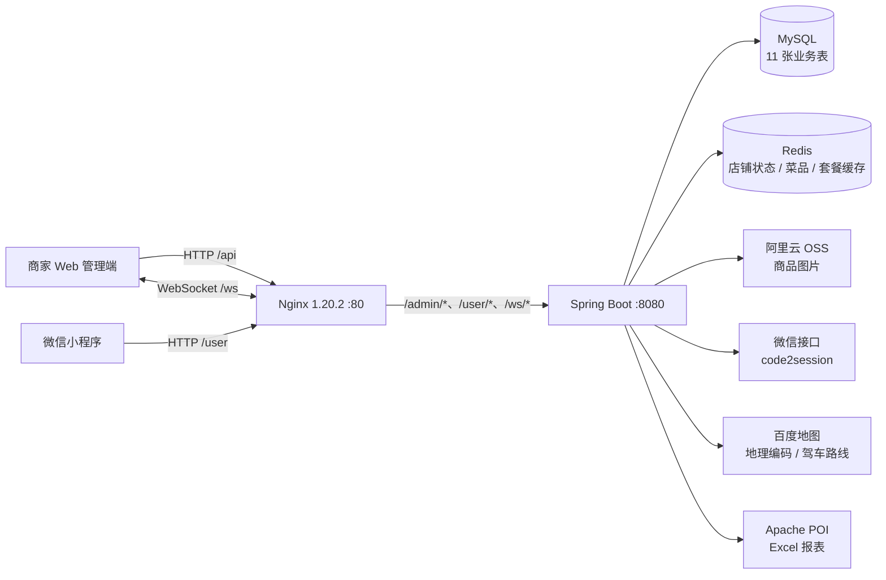
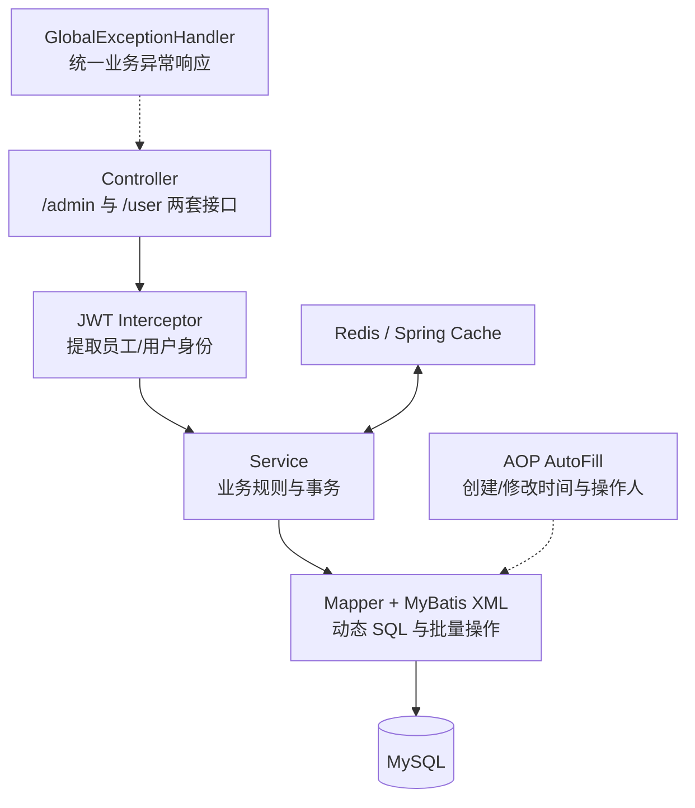
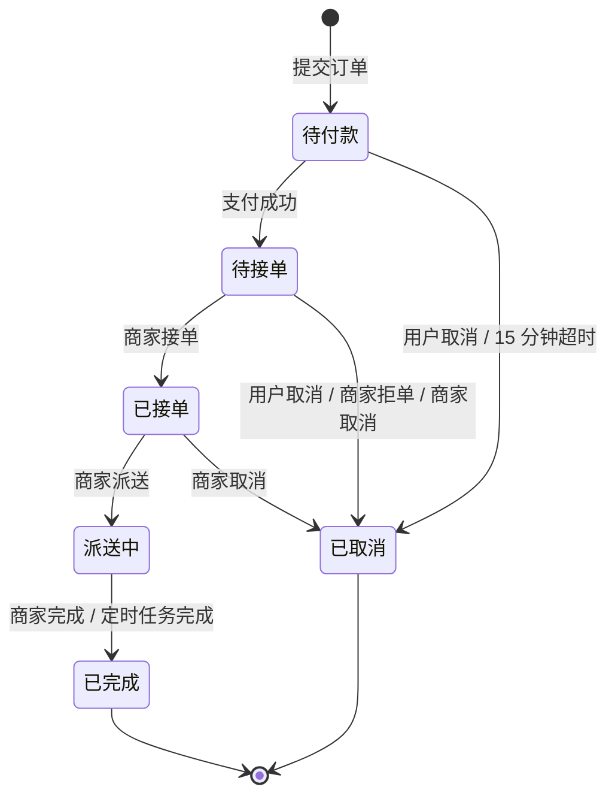
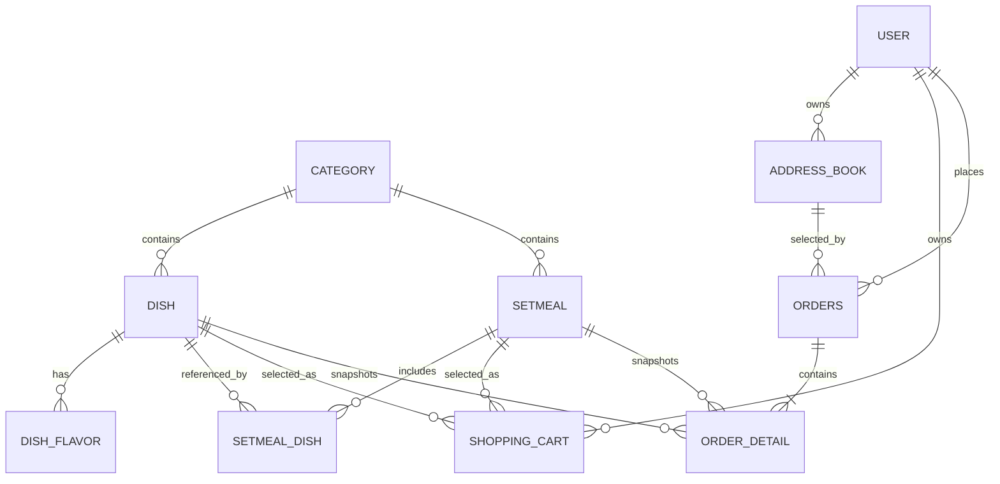

<p align="center">
  
</p>

<h1 align="center">食速达 - 综合购物商城系统</h1>

<p align="center">
  面向校园与本地生活场景的一体化餐饮购物平台<br />
  微信小程序点餐端 · 商家运营管理端 · Java 后端服务 · 数据统计与实时通知
</p>

---

## 目录

- [项目概述](#项目概述)
- [业务角色与功能全景](#业务角色与功能全景)
- [系统架构](#系统架构)
- [技术栈](#技术栈)
- [项目结构](#项目结构)
- [核心业务设计](#核心业务设计)
- [微信小程序](#微信小程序)
- [商家管理端](#商家管理端)
- [后端服务](#后端服务)
- [数据库设计](#数据库设计)
- [接口模型](#接口模型)
- [API 接口清单](#api-接口清单)
- [缓存、定时任务与实时通信](#缓存定时任务与实时通信)
- [配置说明](#配置说明)
- [本地开发与运行](#本地开发与运行)
- [开发文档路线](#开发文档路线)

## 项目概述

食速达是一套覆盖“浏览商品 - 购物车 - 地址 - 下单 - 支付 - 配送 - 售后/复购 - 运营分析”完整链路的综合购物商城系统。项目以餐饮外送为主要业务形态，围绕西安交通大学兴庆校区等校园生活场景，为消费者提供菜品与套餐选购服务，为商家提供商品、人员、订单、营业状态和经营数据管理能力。

系统由三类应用共同组成：

1. **微信小程序用户端**：完成微信登录、商品浏览、规格选择、购物车、地址管理、订单提交、支付、订单查询、催单与再来一单。
2. **商家 Web 管理端**：完成员工、分类、菜品、套餐、订单、营业状态、工作台、数据统计与报表导出。
3. **Java 后端服务**：统一承载身份认证、业务校验、数据访问、缓存、任务调度、实时消息、对象存储和第三方地图能力。

项目核心数据规模为 **11 张业务表、70 个后端 HTTP 接口、11 个小程序页面**，同时提供 WebSocket 实时通知、Redis 缓存、每日推荐菜品、百度地图配送范围校验以及 Excel 运营数据导出。

## 业务角色与功能全景

| 角色 | 使用入口 | 核心目标 | 主要能力 |
| --- | --- | --- | --- |
| 消费者 | 微信小程序 | 快速完成选购和履约 | 微信登录、查看营业状态、浏览菜品/套餐、选择口味、维护购物车、管理地址、填写备注、选择配送时间与餐具、支付、取消、催单、查看历史订单、再来一单、查看每日推荐菜品 |
| 商家员工 | Web 管理端 | 处理日常经营业务 | 登录、员工管理、分类管理、菜品管理、套餐管理、订单接单/拒单/取消/派送/完成、营业状态切换 |
| 运营管理者 | Web 管理端 | 掌握经营情况 | 今日数据、订单总览、菜品/套餐总览、营业额、用户、订单完成率、销量 Top 10、近 30 天 Excel 报表 |
| 系统服务 | Java 后端 | 保证业务自动运行 | JWT 鉴权、公共字段自动填充、缓存同步、超时订单处理、派送订单完成、每日推荐菜品生成、WebSocket 通知、异常统一处理 |

### 功能模块

| 端 | 模块 | 功能 |
| --- | --- | --- |
| 管理端 | 员工管理 | 员工新增、分页查询、详情、编辑、启用/禁用，默认密码初始化 |
| 管理端 | 分类管理 | 菜品分类与套餐分类新增、分页、编辑、启用/禁用、关联校验删除 |
| 管理端 | 菜品管理 | 菜品与口味联合新增/编辑、分页、详情、分类查询、起售/停售、批量删除、图片上传 |
| 管理端 | 套餐管理 | 套餐与菜品关联、分页、详情、起售/停售、批量删除、缓存同步 |
| 管理端 | 订单管理 | 条件搜索、状态数量统计、订单详情、接单、拒单、取消、派送、完成 |
| 管理端 | 工作台 | 今日营业额、有效订单、完成率、客单价、新增用户、订单概览、商品概览 |
| 管理端 | 数据统计 | 营业额趋势、用户趋势、订单趋势、销量 Top 10、运营报表导出 |
| 用户端 | 商品浏览 | 营业状态、分类、菜品、套餐、口味、套餐明细、商品详情 |
| 用户端 | 每日推荐 | 每天 06:00 随机推荐三道起售菜品，按收货地址配送范围过滤 |
| 用户端 | 购物车 | 加入购物车、同商品数量累加、列表展示、清空、金额汇总 |
| 用户端 | 地址簿 | 地址列表、新增、编辑、删除、默认地址设置与查询 |
| 用户端 | 订单 | 提交、支付、详情、历史分页、取消、催单、再来一单、配送范围校验 |

## 系统架构



### 后端分层



### 请求路由

| 入口 | Nginx 转发目标 | 用途 |
| --- | --- | --- |
| `/` | `nginx-1.20.2/html/fs` | 管理端静态页面 |
| `/api/*` | `http://localhost:8080/admin/*` | 管理端 API |
| `/user/*` | `http://webservers/user/*` | 用户端 API |
| `/ws/*` | `http://webservers/ws/*` | WebSocket 长连接 |

## 技术栈

### 后端

| 分类 | 技术 | 版本/用途 |
| --- | --- | --- |
| 基础框架 | Spring Boot | 2.7.3 |
| Web | Spring MVC | REST API、拦截器、JSON 转换 |
| 构建 | Maven | 多模块工程与依赖管理 |
| 数据访问 | MyBatis Spring Boot Starter | 2.2.0 |
| 数据源 | Druid | 1.2.28 |
| 分页 | PageHelper | 1.3.0 |
| 数据库 | MySQL | 核心业务数据 |
| 缓存 | Spring Data Redis、Spring Cache | 菜品、套餐和店铺状态 |
| 安全认证 | JWT / JJWT | 0.9.1，员工与用户双令牌体系 |
| 切面 | Spring AOP / AspectJ | 公共字段自动填充 |
| 实时通信 | Jakarta WebSocket | 来单提醒、用户催单 |
| 对象存储 | Aliyun OSS SDK | 3.10.2，上传商品图片 |
| HTTP 客户端 | Apache HttpClient 封装 | 微信登录、百度地图接口调用 |
| JSON | Jackson、Fastjson | 统一序列化与第三方响应解析 |
| Excel | Apache POI | 3.16，运营数据导出 |
| 接口文档 | Knife4j / Swagger 2 | 3.0.2 |
| 辅助 | Lombok | 1.18.20 |

### 管理端与小程序

| 端 | 技术组成 |
| --- | --- |
| 商家管理端 | Vue 2、TypeScript、Vue Router、Vuex、Axios、Element UI、ECharts、Moment、SCSS、PWA 静态资源 |
| 微信小程序 | uni-app、Vue 2、微信小程序基础库 2.25.4、Uni UI 组件、WXML/WXSS、微信登录能力 |
| Web 服务 | Nginx 1.20.2，静态资源托管、反向代理、WebSocket 升级 |

## 项目结构

```text
food-swift/
├─ pom.xml                         # Maven 父工程，聚合 3 个后端模块
├─ SQL.md                          # 11 张业务表的数据库设计文档
├─ fs-common/                      # 公共基础模块
│  └─ src/main/java/com/fs/
│     ├─ constant/                 # 状态、密码、JWT、提示信息常量
│     ├─ context/                  # ThreadLocal 当前用户上下文
│     ├─ exception/                # 账号、订单、购物车等业务异常
│     ├─ json/                     # Jackson 日期与时间格式配置
│     ├─ properties/               # JWT、微信、OSS 配置映射
│     ├─ result/                   # Result、PageResult 统一响应
│     └─ utils/                    # JWT、HTTP、阿里云 OSS 工具
├─ fs-pojo/                        # 领域对象模块
│  └─ src/main/java/com/fs/
│     ├─ entity/                   # 11 个数据库实体
│     ├─ dto/                      # 管理端与用户端请求对象
│     └─ vo/                       # 登录、订单、报表、工作台响应对象
├─ fs-server/                      # Spring Boot 服务模块
│  ├─ src/main/java/com/fs/
│  │  ├─ controller/admin/         # 管理端 9 类控制器
│  │  ├─ controller/user/          # 用户端 9 类控制器（含每日推荐）
│  │  ├─ service/impl/             # 业务实现
│  │  ├─ mapper/                   # MyBatis Mapper 接口
│  │  ├─ interceptor/              # 管理端/用户端 JWT 拦截器
│  │  ├─ annotation/ + aspect/     # @AutoFill 与自动填充切面
│  │  ├─ config/                   # MVC、Redis、OSS、WebSocket 配置
│  │  ├─ component/                # 地图距离组件（配送范围校验）
│  │  ├─ handler/                  # 全局异常处理
│  │  ├─ task/                     # 订单与每日推荐定时任务
│  │  └─ websocket/                # WebSocket 会话与群发
│  └─ src/main/resources/
│     ├─ application.yml           # 主配置
│     ├─ application-dev.yml       # 开发环境配置
│     ├─ mapper/                   # 11 个 MyBatis XML
│     └─ template/运营数据报表模板.xlsx
├─ nginx-1.20.2/
│  ├─ conf/nginx.conf              # 静态资源、API 与 WebSocket 代理
│  └─ html/fs/                     # 商家管理端发布资源
├─ pictures/                       # 菜品与套餐示例图片
└─ fs-server/src/test/             # HTTP、POI、Redis 测试代码
```

微信小程序工程：

```text
ssd-mini-program/
├─ app.js / app.json / app.wxss    # 小程序入口、页面注册与全局样式
├─ project.config.json             # 微信开发者工具配置
├─ common/                         # uni-app 运行时、公共依赖、主题
├─ components/                     # 空状态、导航栏、弹窗、选择器等组件
├─ pages/                          # 11 个业务页面
├─ static/                         # Logo、订单、地址、支付等图片资源
├─ uni_modules/                    # uni-badge、uni-list、uni-popup 等组件
└─ node-modules/                   # 构建后的小程序组件依赖
```

## 核心业务设计

### 1. 双端身份认证

管理端登录接收用户名和密码，服务端按用户名查询员工，完成密码摘要比对与账号状态校验，将员工 ID 写入 JWT。管理端后续请求通过 `token` 请求头携带令牌。

用户端调用 `wx.login` 获得临时 `code`，后端调用微信 `jscode2session` 换取 `openid`。首次登录自动创建用户，随后签发包含用户 ID 的 JWT；小程序通过 `authentication` 请求头携带令牌。

JWT 拦截器解析身份后将 ID 放入 `BaseContext` 的 `ThreadLocal<Long>`，Service 与 AOP 可在同一请求线程内取得当前员工或用户。

| 端 | 登录接口 | 请求头 | JWT 内容 | 有效期配置 |
| --- | --- | --- | --- | --- |
| 管理端 | `POST /admin/employee/login` | `token` | `empId` | `fs.jwt.admin-ttl` |
| 用户端 | `POST /user/user/login` | `authentication` | `userId` | `fs.jwt.user-ttl` |

### 2. 分类、菜品与套餐

- 分类分为菜品分类 `type=1` 与套餐分类 `type=2`，支持排序和启用状态。
- 删除分类前分别统计关联菜品或套餐，存在关联数据时阻止删除。
- 菜品由 `dish` 与 `dish_flavor` 两张表共同组成；新增、修改和批量删除使用事务保证一致性。
- 编辑菜品口味时先删除原口味，再批量插入新口味。
- 起售中的菜品不可删除；被套餐关联的菜品不可删除。
- 套餐由 `setmeal` 与 `setmeal_dish` 组成；新增时同时保存套餐主数据和关联菜品。
- 起售套餐前检查套餐内菜品状态，只要存在停售菜品便阻止套餐起售。
- 商品图片通过管理端上传到阿里云 OSS，数据库保存访问地址。

### 3. 购物车

购物车通过当前 JWT 用户隔离数据。加入商品时先按用户、菜品/套餐及口味查询：若已存在则数量加一，否则补全商品名称、图片、单价、创建时间并插入新记录。结算页面基于购物车明细计算商品数量、商品金额、打包费和配送费。

### 4. 地址与配送范围

地址簿支持省、市、区编码与名称、详细地址、联系人、性别、手机号、标签和默认地址。设置默认地址在一个事务中完成：先取消当前用户全部默认标记，再将选中地址设为默认。

提交订单时，后端先把店铺地址和用户收货地址分别转换为经纬度，再通过百度地图驾车路线接口计算实际路线距离；距离超过 5 公里时拒绝下单。

### 5. 下单与订单状态机

提交订单会依次执行：

1. 校验地址存在；
2. 查询并校验当前用户购物车非空；
3. 拼装收货人、电话和完整地址；
4. 校验配送距离；
5. 写入订单主表，初始状态为待付款；
6. 将购物车批量复制为订单明细；
7. 清空当前用户购物车；
8. 返回订单 ID、订单号、金额与下单时间。



| 状态字段 | 值 | 含义 |
| --- | --- | --- |
| `orders.status` | 1 | 待付款 |
| `orders.status` | 2 | 待接单 |
| `orders.status` | 3 | 已接单/待派送 |
| `orders.status` | 4 | 派送中 |
| `orders.status` | 5 | 已完成 |
| `orders.status` | 6 | 已取消 |
| `orders.pay_status` | 0 | 未支付 |
| `orders.pay_status` | 1 | 已支付 |
| `orders.pay_status` | 2 | 退款 |

订单支持立即配送或预约配送、餐具按餐量提供或指定数量、订单备注、打包费、支付方式、预计送达时间等信息。支付完成后订单进入待接单状态，并通过 WebSocket 向管理端推送来单提醒。

### 6. 订单履约与复购

- 用户可分页查看全部或指定状态的历史订单，并查看订单明细。
- 待付款或待接单订单可取消；已支付订单取消时同步更新退款状态。
- “再来一单”会把原订单明细复制为当前用户购物车记录。
- 用户催单会向管理端广播 `type=2` 的 WebSocket 消息。
- 管理端支持按订单号、手机号、状态和时间范围搜索，执行接单、拒单、取消、派送、完成操作。

### 7. 工作台与经营分析

| 指标 | 计算口径 |
| --- | --- |
| 营业额 | 指定时间内状态为“已完成”的订单金额合计 |
| 有效订单 | 指定时间内已完成订单数量 |
| 订单完成率 | 有效订单数 ÷ 总订单数 |
| 平均客单价 | 营业额 ÷ 有效订单数 |
| 新增用户 | 指定时间内新注册用户数 |
| 销量 Top 10 | 指定时间内订单明细按商品汇总销量并取前十 |

报表支持昨日、近 7 日、近 30 日、本周、本月等时间区间。Excel 导出以模板为基础，生成最近 30 天的汇总数据和逐日明细。

### 8. 每日推荐菜品

- `DishRecommendTask` 每天 06:00（cron `0 0 6 * * ?`）从全部起售菜品中随机抽取三道，缓存为当日推荐；推荐结果保存于内存，服务重启或到达次日 06:00 后自动更新。若服务启动后尚未到执行时间，首次查询会立即生成一次推荐，保证接口随时可用。
- 该功能按“业务逻辑直接写在定时任务类中”的方式实现，不经过 Service 层，定时任务类直接持有 `DishMapper`、`AddressBookMapper` 与 `MapDistanceComponent`。
- 推荐接口为 `GET /user/dishRecommend/list`，按当前登录用户做距离过滤：仅当店铺位于该用户收货地址的配送范围内时才返回推荐菜品，超出配送范围返回空列表。
- 距离判定复用 `MapDistanceComponent.isWithinRange`（由下单流程的 `checkOutOfRange` 重构而来）：优先使用用户默认地址，无默认地址时使用任一收货地址；用户未填写地址时不做距离过滤；地图服务异常时降级为正常推荐，避免影响接口可用性。

## 微信小程序

### 页面清单

| 页面 | 路径 | 主要内容 |
| --- | --- | --- |
| 首页/点餐 | `pages/index/index` | 自动微信登录、营业状态、分类切换、菜品/套餐、商品详情、口味规格、购物车、结算入口 |
| 确认订单 | `pages/order/index` | 默认地址、订单商品、配送时间、备注、餐具、打包费、配送费、合计、提交订单 |
| 订单详情 | `pages/details/index` | 状态、倒计时、商品明细、金额、配送地址、订单信息、取消、支付、催单、退款展示、再来一单 |
| 支付 | `pages/pay/index` | 支付倒计时、金额、确认支付、超时处理 |
| 下单成功 | `pages/success/index` | 预计送达、返回首页、查看订单 |
| 无网络 | `pages/nonet/index` | 网络异常提示与刷新 |
| 地址列表 | `pages/address/address` | 地址展示、选择、设置默认、新增与编辑入口 |
| 订单备注 | `pages/remark/index` | 50 字备注编辑与保存 |
| 个人中心 | `pages/my/my` | 头像、昵称、登录状态、地址管理、历史订单、最近订单、再来一单、去支付 |
| 新增/编辑地址 | `pages/addOrEditAddress/addOrEditAddress` | 联系人、手机号、省市区、详细地址、标签、保存与删除 |
| 历史订单 | `pages/historyOrder/historyOrder` | 状态筛选、下拉刷新、触底分页、详情、支付、催单、再来一单 |

### 小程序交互链路


小程序全局主题采用食速达橙色视觉体系，包含品牌 Logo、商品默认图、购物车、地址、订单、支付、成功、无网络等静态资源，并使用空状态、触底提示、导航栏、弹窗、地址选择器等通用组件。

## 商家管理端

### 页面与导航

| 路由 | 页面 | 说明 |
| --- | --- | --- |
| `/login` | 登录 | 员工账号登录 |
| `/dashboard` | 工作台 | 今日经营数据、订单与商品总览、最新订单 |
| `/statistics` | 数据统计 | 营业额、用户、订单、销量排行与报表导出 |
| `/order` | 订单管理 | 状态切换、条件搜索、详情及履约操作 |
| `/setmeal` | 套餐管理 | 查询、新增、修改、删除、起售/停售 |
| `/setmeal/add` | 新增/编辑套餐 | 套餐信息、分类、图片、关联菜品 |
| `/dish` | 菜品管理 | 查询、新增、修改、删除、起售/停售 |
| `/dish/add` | 新增/编辑菜品 | 菜品信息、分类、图片、价格、口味 |
| `/category` | 分类管理 | 菜品/套餐分类 CRUD 与状态管理 |
| `/employee` | 员工管理 | 员工查询、状态切换、编辑 |
| `/employee/add` | 新增/编辑员工 | 用户名、姓名、手机号、性别、身份证号 |

### 实时通知

管理端建立 `/ws/{sid}` WebSocket 连接。服务端广播 JSON 消息：

```json
{
  "type": 1,
  "orderId": 10001,
  "content": "订单号：202607190001"
}
```

`type=1` 表示来单提醒，`type=2` 表示用户催单。管理端收到消息后展示通知并播放对应提示音，可直接进入订单详情处理。

## 后端服务

### Maven 模块

| 模块 | 依赖关系 | 职责 |
| --- | --- | --- |
| `fs-common` | 独立公共模块 | 常量、异常、配置属性、上下文、结果封装、JWT、HTTP、OSS、JSON |
| `fs-pojo` | 领域模型模块 | Entity、DTO、VO |
| `fs-server` | 依赖 `fs-common` 与 `fs-pojo` | Controller、Service、Mapper、AOP、拦截器、任务、WebSocket、配置与应用入口 |

### 统一响应

普通接口使用 `Result<T>`：

```json
{
  "code": 1,
  "msg": null,
  "data": {}
}
```

- `code=1`：成功。
- `code=0`：业务失败，错误原因写入 `msg`。
- 分页数据使用 `PageResult`，包含 `total` 与 `records`。
- JWT 校验失败返回 HTTP `401`。
- 日期格式为 `yyyy-MM-dd`，日期时间格式为 `yyyy-MM-dd HH:mm`，时间格式为 `HH:mm:ss`。

### 公共字段自动填充

Mapper 的插入或更新方法通过 `@AutoFill(OperationType.INSERT/UPDATE)` 标记。`AutoFillAspect` 在数据库操作前使用反射填充：

| 操作 | 自动字段 |
| --- | --- |
| INSERT | `createTime`、`createUser`、`updateTime`、`updateUser` |
| UPDATE | `updateTime`、`updateUser` |

### 事务边界

事务用于需要跨表一致性的业务，包括：菜品与口味新增/修改/删除、套餐与关联菜品新增/删除、设置默认地址、提交订单与订单明细、清空购物车等。

## 数据库设计

### 关系模型



项目使用逻辑外键维护业务关系，订单明细、购物车和套餐菜品关系中保存名称、价格、图片等快照/冗余信息，减少展示时的多表查询并保留交易发生时的数据。

### 11 张业务表

| 表 | 中文名称 | 字段（类型） | 核心规则 |
| --- | --- | --- | --- |
| `employee` | 员工表 | `id bigint`、`name varchar(32)`、`username varchar(32)`、`password varchar(64)`、`phone varchar(11)`、`sex varchar(2)`、`id_number varchar(18)`、`status int`、`create_time datetime`、`update_time datetime`、`create_user bigint`、`update_user bigint` | 用户名唯一；状态 1 正常、0 锁定 |
| `category` | 分类表 | `id bigint`、`name varchar(32)`、`type int`、`sort int`、`status int`、`create_time datetime`、`update_time datetime`、`create_user bigint`、`update_user bigint` | type 1 菜品、2 套餐；status 1 启用、0 禁用 |
| `dish` | 菜品表 | `id bigint`、`name varchar(32)`、`category_id bigint`、`price decimal(10,2)`、`image varchar(255)`、`description varchar(255)`、`status int`、审计字段 | 菜品名称唯一；状态 1 起售、0 停售 |
| `dish_flavor` | 菜品口味表 | `id bigint`、`dish_id bigint`、`name varchar(32)`、`value varchar(255)` | 一个菜品可配置多组口味，value 保存口味选项集合 |
| `setmeal` | 套餐表 | `id bigint`、`name varchar(32)`、`category_id bigint`、`price decimal(10,2)`、`image varchar(255)`、`description varchar(255)`、`status int`、审计字段 | 套餐名称唯一；状态 1 起售、0 停售 |
| `setmeal_dish` | 套餐菜品关系表 | `id bigint`、`setmeal_id bigint`、`dish_id bigint`、`name varchar(32)`、`price decimal(10,2)`、`copies int` | 保存套餐内菜品、份数及名称/价格冗余字段 |
| `user` | 用户表 | `id bigint`、`openid varchar(45)`、`name varchar(32)`、`phone varchar(11)`、`sex varchar(2)`、`id_number varchar(18)`、`avatar varchar(500)`、`create_time datetime` | openid 标识微信用户 |
| `address_book` | 地址表 | `id bigint`、`user_id bigint`、`consignee varchar(50)`、`sex varchar(2)`、`phone varchar(11)`、省市区编码与名称、`detail varchar(200)`、`label varchar(100)`、`is_default tinyint(1)` | 用户拥有多地址，默认地址 1 是、0 否 |
| `shopping_cart` | 购物车表 | `id bigint`、`name varchar(32)`、`image varchar(255)`、`user_id bigint`、`dish_id bigint`、`setmeal_id bigint`、`dish_flavor varchar(50)`、`number int`、`amount decimal(10,2)`、`create_time datetime` | 菜品与套餐二选一；按用户隔离 |
| `orders` | 订单表 | `id`、`number`、`status`、`user_id`、`address_book_id`、下单/支付/取消/预计送达/送达时间、`pay_method`、`pay_status`、`amount`、备注、用户与地址快照、取消/拒单原因、配送/餐具/打包字段 | 保存订单全生命周期和履约信息 |
| `order_detail` | 订单明细表 | `id bigint`、`name varchar(32)`、`image varchar(255)`、`order_id bigint`、`dish_id bigint`、`setmeal_id bigint`、`dish_flavor varchar(50)`、`number int`、`amount decimal(10,2)` | 保存下单时商品快照 |

## 接口模型

### 请求 DTO

| DTO | 字段 |
| --- | --- |
| `EmployeeLoginDTO` | `username`、`password` |
| `EmployeeDTO` | `id`、`username`、`name`、`phone`、`sex`、`idNumber` |
| `EmployeePageQueryDTO` | `name`、`page`、`pageSize` |
| `PasswordEditDTO` | `empId`、`oldPassword`、`newPassword` |
| `CategoryDTO` | `id`、`type`、`name`、`sort` |
| `CategoryPageQueryDTO` | `page`、`pageSize`、`name`、`type` |
| `DishDTO` | `id`、`name`、`categoryId`、`price`、`image`、`description`、`status`、`flavors` |
| `DishPageQueryDTO` | `page`、`pageSize`、`name`、`categoryId`、`status` |
| `SetmealDTO` | `id`、`categoryId`、`name`、`price`、`status`、`description`、`image`、`setmealDishes` |
| `SetmealPageQueryDTO` | `page`、`pageSize`、`name`、`categoryId`、`status` |
| `ShoppingCartDTO` | `dishId`、`setmealId`、`dishFlavor` |
| `UserLoginDTO` | `code` |
| `OrdersSubmitDTO` | `addressBookId`、`payMethod`、`remark`、`estimatedDeliveryTime`、`deliveryStatus`、`tablewareNumber`、`tablewareStatus`、`packAmount`、`amount` |
| `OrdersPaymentDTO` | `orderNumber`、`payMethod` |
| `OrdersPageQueryDTO` | `page`、`pageSize`、`number`、`phone`、`status`、`beginTime`、`endTime`、`userId` |
| `OrdersConfirmDTO` | `id`、`status` |
| `OrdersRejectionDTO` | `id`、`rejectionReason` |
| `OrdersCancelDTO` | `id`、`cancelReason` |
| `DataOverViewQueryDTO` | `begin`、`end` |
| `GoodsSalesDTO` | `name`、`number` |

### 响应 VO

| VO | 字段 |
| --- | --- |
| `EmployeeLoginVO` | `id`、`userName`、`name`、`token` |
| `UserLoginVO` | `id`、`openid`、`token` |
| `DishVO` | 菜品字段、`categoryName`、`flavors` |
| `SetmealVO` | 套餐字段、`categoryName`、`setmealDishes` |
| `DishItemVO` | `name`、`copies`、`image`、`description` |
| `OrderSubmitVO` | `id`、`orderNumber`、`orderAmount`、`orderTime` |
| `OrderVO` | 订单全部字段、`orderDishes`、`orderDetailList` |
| `OrderStatisticsVO` | `toBeConfirmed`、`confirmed`、`deliveryInProgress` |
| `BusinessDataVO` | `turnover`、`validOrderCount`、`orderCompletionRate`、`unitPrice`、`newUsers` |
| `OrderOverViewVO` | `waitingOrders`、`deliveredOrders`、`completedOrders`、`cancelledOrders`、`allOrders` |
| `DishOverViewVO` | `sold`、`discontinued` |
| `SetmealOverViewVO` | `sold`、`discontinued` |
| `TurnoverReportVO` | `dateList`、`turnoverList` |
| `UserReportVO` | `dateList`、`totalUserList`、`newUserList` |
| `OrderReportVO` | `dateList`、`orderCountList`、`validOrderCountList`、`totalOrderCount`、`validOrderCount`、`orderCompletionRate` |
| `SalesTop10ReportVO` | `nameList`、`numberList` |

## API 接口清单

后端真实服务路径以 `/admin` 与 `/user` 开头。管理端页面经 Nginx `/api` 代理后，会自动映射到 `/admin`。

### 管理端 API（46 个）

| 模块 | 方法 | 路径 | 参数 | 说明 |
| --- | --- | --- | --- | --- |
| 员工 | POST | `/admin/employee/login` | Body `EmployeeLoginDTO` | 员工登录并签发 JWT |
| 员工 | POST | `/admin/employee/logout` | - | 退出登录 |
| 员工 | POST | `/admin/employee` | Body `EmployeeDTO` | 新增员工 |
| 员工 | GET | `/admin/employee/page` | `name,page,pageSize` | 员工分页查询 |
| 员工 | POST | `/admin/employee/status/{status}` | Path `status`，Query `id` | 启用/禁用员工 |
| 员工 | GET | `/admin/employee/{id}` | Path `id` | 员工详情 |
| 员工 | PUT | `/admin/employee` | Body `EmployeeDTO` | 编辑员工 |
| 分类 | POST | `/admin/category` | Body `CategoryDTO` | 新增分类 |
| 分类 | GET | `/admin/category/page` | `page,pageSize,name,type` | 分类分页查询 |
| 分类 | DELETE | `/admin/category` | Query `id` | 删除分类 |
| 分类 | PUT | `/admin/category` | Body `CategoryDTO` | 修改分类 |
| 分类 | POST | `/admin/category/status/{status}` | Path `status`，Query `id` | 启用/禁用分类 |
| 分类 | GET | `/admin/category/list` | Query `type` | 按类型查询分类 |
| 公共 | POST | `/admin/common/upload` | Multipart `file` | 上传图片到 OSS |
| 菜品 | POST | `/admin/dish` | Body `DishDTO` | 新增菜品及口味 |
| 菜品 | GET | `/admin/dish/page` | `page,pageSize,name,categoryId,status` | 菜品分页查询 |
| 菜品 | DELETE | `/admin/dish` | Query `ids` | 批量删除菜品及口味 |
| 菜品 | GET | `/admin/dish/{id}` | Path `id` | 菜品及口味详情 |
| 菜品 | PUT | `/admin/dish` | Body `DishDTO` | 修改菜品及口味 |
| 菜品 | POST | `/admin/dish/status/{status}` | Path `status`，Query `id` | 起售/停售菜品 |
| 菜品 | GET | `/admin/dish/list` | Query `categoryId` | 查询分类下起售菜品 |
| 套餐 | POST | `/admin/setmeal` | Body `SetmealDTO` | 新增套餐及关联菜品 |
| 套餐 | GET | `/admin/setmeal/page` | `page,pageSize,name,categoryId,status` | 套餐分页查询 |
| 套餐 | DELETE | `/admin/setmeal` | Query `ids` | 批量删除套餐 |
| 套餐 | GET | `/admin/setmeal/{id}` | Path `id` | 套餐及关联菜品详情 |
| 套餐 | PUT | `/admin/setmeal` | Body `SetmealDTO` | 修改套餐 |
| 套餐 | POST | `/admin/setmeal/status/{status}` | Path `status`，Query `id` | 起售/停售套餐 |
| 店铺 | PUT | `/admin/shop/{status}` | Path `status` | 设置营业/打烊状态 |
| 店铺 | GET | `/admin/shop/status` | - | 获取营业状态 |
| 订单 | GET | `/admin/order/conditionSearch` | `OrdersPageQueryDTO` | 多条件分页搜索订单 |
| 订单 | GET | `/admin/order/statistics` | - | 待接单、待派送、派送中数量 |
| 订单 | GET | `/admin/order/details/{id}` | Path `id` | 管理端订单详情 |
| 订单 | PUT | `/admin/order/confirm` | Body `OrdersConfirmDTO` | 接单 |
| 订单 | PUT | `/admin/order/rejection` | Body `OrdersRejectionDTO` | 拒单并记录原因 |
| 订单 | PUT | `/admin/order/cancel` | Body `OrdersCancelDTO` | 商家取消订单 |
| 订单 | PUT | `/admin/order/delivery/{id}` | Path `id` | 更新为派送中 |
| 订单 | PUT | `/admin/order/complete/{id}` | Path `id` | 完成订单 |
| 报表 | GET | `/admin/report/turnoverStatistics` | `begin,end` | 每日营业额趋势 |
| 报表 | GET | `/admin/report/userStatistics` | `begin,end` | 用户总量与新增用户趋势 |
| 报表 | GET | `/admin/report/ordersStatistics` | `begin,end` | 订单量、有效订单与完成率 |
| 报表 | GET | `/admin/report/top10` | `begin,end` | 商品销量 Top 10 |
| 报表 | GET | `/admin/report/export` | - | 下载最近 30 天运营 Excel |
| 工作台 | GET | `/admin/workspace/businessData` | - | 今日核心经营数据 |
| 工作台 | GET | `/admin/workspace/overviewOrders` | - | 今日订单概览 |
| 工作台 | GET | `/admin/workspace/overviewDishes` | - | 菜品起售/停售概览 |
| 工作台 | GET | `/admin/workspace/overviewSetmeals` | - | 套餐起售/停售概览 |

### 用户端 API（24 个）

| 模块 | 方法 | 路径 | 参数 | 说明 |
| --- | --- | --- | --- | --- |
| 用户 | POST | `/user/user/login` | Body `UserLoginDTO` | 微信 code 登录、注册并签发 JWT |
| 店铺 | GET | `/user/shop/status` | - | 查询营业状态 |
| 分类 | GET | `/user/category/list` | Query `type` 可选 | 查询启用分类 |
| 菜品 | GET | `/user/dish/list` | Query `categoryId` | 查询起售菜品与口味 |
| 推荐 | GET | `/user/dishRecommend/list` | - | 查询今日推荐的三道随机菜品（按配送范围过滤） |
| 套餐 | GET | `/user/setmeal/list` | Query `categoryId` | 查询起售套餐 |
| 套餐 | GET | `/user/setmeal/dish/{id}` | Path `id` | 查询套餐内菜品 |
| 购物车 | POST | `/user/shoppingCart/add` | Body `ShoppingCartDTO` | 添加商品或数量加一 |
| 购物车 | GET | `/user/shoppingCart/list` | - | 当前用户购物车 |
| 购物车 | DELETE | `/user/shoppingCart/clean` | - | 清空当前用户购物车 |
| 地址 | GET | `/user/addressBook/list` | - | 当前用户地址列表 |
| 地址 | POST | `/user/addressBook` | Body `AddressBook` | 新增地址 |
| 地址 | GET | `/user/addressBook/{id}` | Path `id` | 地址详情 |
| 地址 | PUT | `/user/addressBook` | Body `AddressBook` | 修改地址 |
| 地址 | PUT | `/user/addressBook/default` | Body `{id}` | 设置默认地址 |
| 地址 | DELETE | `/user/addressBook` | Query `id` | 删除地址 |
| 地址 | GET | `/user/addressBook/default` | - | 查询默认地址 |
| 订单 | POST | `/user/order/submit` | Body `OrdersSubmitDTO` | 提交订单 |
| 订单 | PUT | `/user/order/payment` | Body `OrdersPaymentDTO` | 支付并推送来单提醒 |
| 订单 | GET | `/user/order/historyOrders` | `page,pageSize,status` | 历史订单分页 |
| 订单 | GET | `/user/order/orderDetail/{id}` | Path `id` | 用户订单详情 |
| 订单 | PUT | `/user/order/cancel/{id}` | Path `id` | 用户取消订单 |
| 订单 | POST | `/user/order/repetition/{id}` | Path `id` | 再来一单 |
| 订单 | GET | `/user/order/reminder/{id}` | Path `id` | 催单并通知管理端 |

## 缓存、定时任务与实时通信

### Redis 键

| 键 | 类型 | 内容 | 更新策略 |
| --- | --- | --- | --- |
| `SHOP_STATUS` | String/Integer | 1 营业、0 打烊 | 管理端设置，双端读取 |
| `dish_{categoryId}` | Value | 分类下起售菜品及口味 | 用户查询时写入；管理端菜品变更后清理 `dish_*` |
| `setmealCache::{categoryId}` | Spring Cache | 分类下起售套餐 | `@Cacheable` 查询；套餐增删改和状态变更时 `@CacheEvict` |
| `SHOP_LOCATION` | String | 店铺经纬度 | 距离组件首次解析店铺地址时写入，有效期 24 小时 |

### Spring Task

| Cron | 频率 | 任务 |
| --- | --- | --- |
| `0 * * * * ?` | 每分钟 | 查询超过 15 分钟仍待付款的订单，自动取消并记录原因 |
| `0 0 1 * * ?` | 每天 01:00 | 查询长时间处于派送中的订单并自动完成 |
| `0 0 6 * * ?` | 每天 06:00 | 从起售菜品中随机抽取三道，生成当日推荐 |

### WebSocket

- 服务端地址：`/ws/{sid}`。
- 建立连接时以 `sid` 保存会话，关闭连接时移除。
- 来单提醒：支付后广播 `type=1`。
- 用户催单：催单接口广播 `type=2`。
- Nginx 为 `/ws/` 设置 HTTP/1.1 Upgrade、Connection 和 3600 秒读取超时。

## 配置说明

主配置文件为 `fs-server/src/main/resources/application.yml`，默认激活 `dev` 环境并监听 `8080` 端口。

| 配置前缀 | 关键项 | 用途 |
| --- | --- | --- |
| `spring.datasource.druid` | driver、url、username、password | MySQL 数据源 |
| `spring.redis` | host、port、password、database | Redis 连接 |
| `mybatis` | mapper-locations、type-aliases-package、map-underscore-to-camel-case | Mapper XML、实体别名、驼峰映射 |
| `fs.jwt` | admin/user secret、ttl、token-name | 双端 JWT |
| `fs.alioss` | endpoint、access-key-id、access-key-secret、bucket-name | 图片对象存储 |
| `fs.wechat` | appid、secret | 微信 code2session |
| `fs.shop.address` | 店铺文本地址 | 配送距离起点 |
| `fs.shop.delivery-range` | 配送范围阈值（米），默认 5000 | 下单与每日推荐的距离判定 |
| `fs.baidu.ak` | 百度地图 AK | 地理编码与路线规划 |

推荐的开发环境配置形态：

```yaml
fs:
  datasource:
    driver-class-name: com.mysql.cj.jdbc.Driver
    host: localhost
    port: 3306
    database: sky_take_out
    username: ${MYSQL_USERNAME}
    password: ${MYSQL_PASSWORD}
  redis:
    host: localhost
    port: 6379
    password: ${REDIS_PASSWORD}
    database: 0
  alioss:
    endpoint: ${ALIYUN_OSS_ENDPOINT}
    access-key-id: ${ALIYUN_ACCESS_KEY_ID}
    access-key-secret: ${ALIYUN_ACCESS_KEY_SECRET}
    bucket-name: ${ALIYUN_OSS_BUCKET}
  wechat:
    appid: ${WECHAT_APP_ID}
    secret: ${WECHAT_APP_SECRET}
  shop:
    address: ${SHOP_ADDRESS}
  baidu:
    ak: ${BAIDU_MAP_AK}
```

## 本地开发与运行

### 环境要求

- JDK 8 或更高版本；
- Maven 3.6+；
- MySQL 5.7/8.x；
- Redis 5+；
- Windows 下可直接使用项目内的 Nginx 1.20.2；
- 微信开发者工具，基础库建议不低于 2.25.4；
- 可用的微信小程序、阿里云 OSS 与百度地图配置。

### 1. 准备数据库

创建数据库：

```sql
CREATE DATABASE sky_take_out
  DEFAULT CHARACTER SET utf8mb4
  COLLATE utf8mb4_unicode_ci;
```

根据根目录 `SQL.md` 的结构创建 `employee`、`category`、`dish`、`dish_flavor`、`setmeal`、`setmeal_dish`、`user`、`address_book`、`shopping_cart`、`orders`、`order_detail` 共 11 张表，并准备至少一个可登录员工账号。

新建员工时系统使用默认密码 `123456`，保存前生成密码摘要。

### 2. 启动 MySQL 与 Redis

确认 `application-dev.yml` 中的数据源和 Redis 配置与本机一致，并保证数据库与缓存服务可访问。

### 3. 构建并启动后端

在后端根目录执行：

```bash
mvn clean package -DskipTests
java -jar fs-server/target/fs-server-1.0-SNAPSHOT.jar
```

也可以直接在 IDE 中运行：

```text
com.fs.FsApplication
```

启动后：

- 服务地址：`http://localhost:8080`
- Knife4j 接口文档：`http://localhost:8080/doc.html`

### 4. 启动商家管理端

进入 `nginx-1.20.2` 目录并启动：

```powershell
.\nginx.exe
```

浏览器访问：

```text
http://localhost
```

重新加载配置：

```powershell
.\nginx.exe -s reload
```

停止服务：

```powershell
.\nginx.exe -s stop
```

### 5. 运行微信小程序

1. 打开微信开发者工具；
2. 导入 `ssd-mini-program` 目录；
3. 配置小程序 AppID；
4. 确认请求基础地址与后端/Nginx 地址一致；
5. 本地调试时按需关闭合法域名、WebView 与 TLS 校验；
6. 编译后从首页完成自动登录并开始点餐。

### 6. 联调顺序

1. 启动 MySQL；
2. 启动 Redis；
3. 启动 Spring Boot 后端；
4. 启动 Nginx 和管理端；
5. 打开微信小程序；
6. 在管理端创建分类、菜品和套餐并起售；
7. 设置店铺为营业中；
8. 在小程序端完成浏览、购物车、地址、下单与支付；
9. 回到管理端处理接单、派送和完成；
10. 在工作台与数据统计中查看经营数据并导出 Excel。

## 开发文档路线

配套开发文档共 81 页，按照 12 个开发阶段覆盖整个系统：

| 阶段 | 建设内容 |
| --- | --- |
| Day 01 | Nginx 反向代理与负载均衡、管理端登录、密码摘要处理 |
| Day 02 | 员工新增、分页、启用/禁用、编辑，分类管理 |
| Day 03 | 公共字段自动填充、AOP、自定义注解、菜品与口味 CRUD |
| Day 04 | 套餐与套餐菜品关系、分页、修改、删除、起售/停售 |
| Day 05 | Redis 基础、Spring Data Redis、店铺营业状态 |
| Day 06 | HttpClient、微信小程序基础、微信登录、商品浏览 |
| Day 07 | Redis 菜品缓存、Spring Cache 套餐缓存、购物车 |
| Day 08 | 地址簿、用户下单、订单主表与明细表、订单支付 |
| Day 09 | 用户历史订单、详情、取消、再来一单，商家订单全流程，配送范围校验 |
| Day 10 | Spring Task 超时订单处理、WebSocket 来单提醒与催单 |
| Day 11 | ECharts 营业额、用户、订单与销量 Top 10 统计 |
| Day 12 | 工作台今日数据与总览、Apache POI 运营数据 Excel 导出 |

---

<p align="center">
  <strong>食速达</strong> · 让点餐、履约与经营管理更高效
</p>
